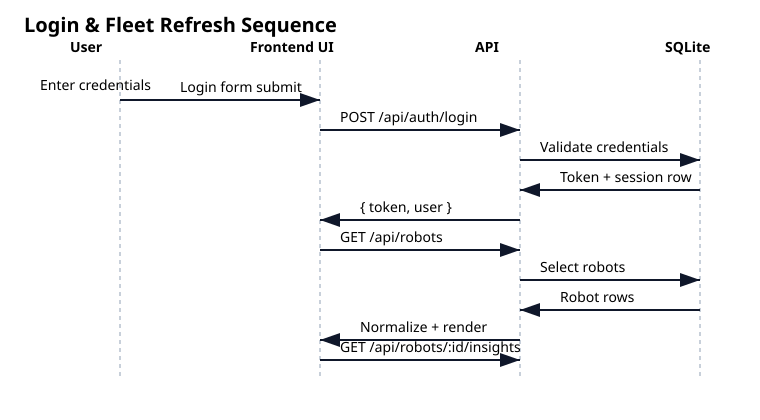
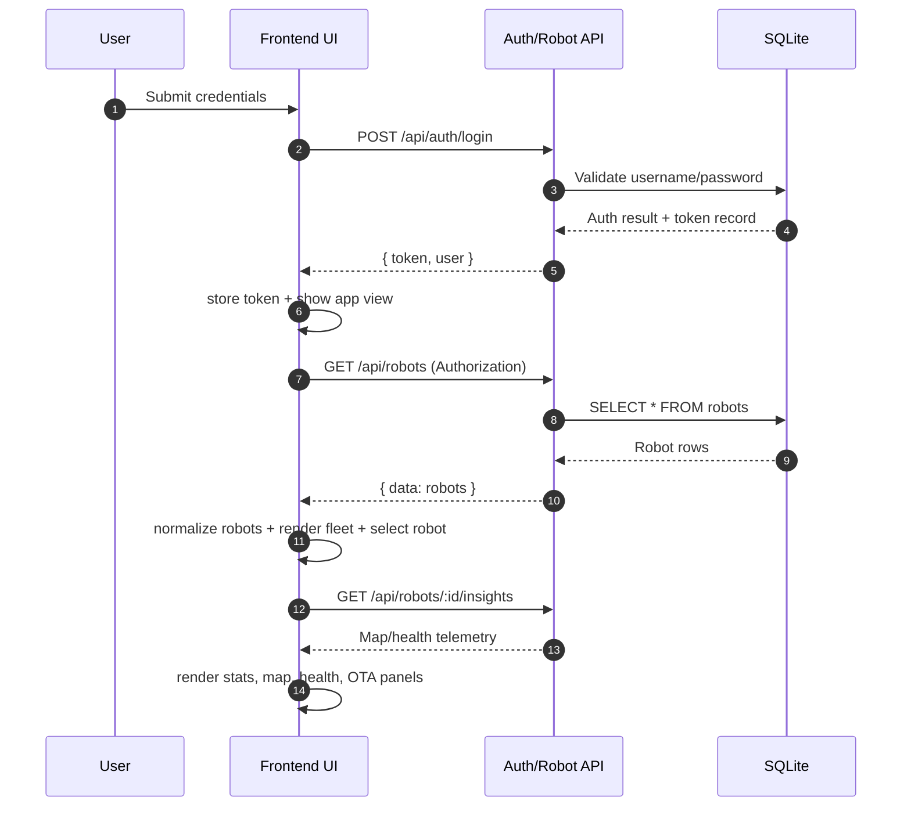
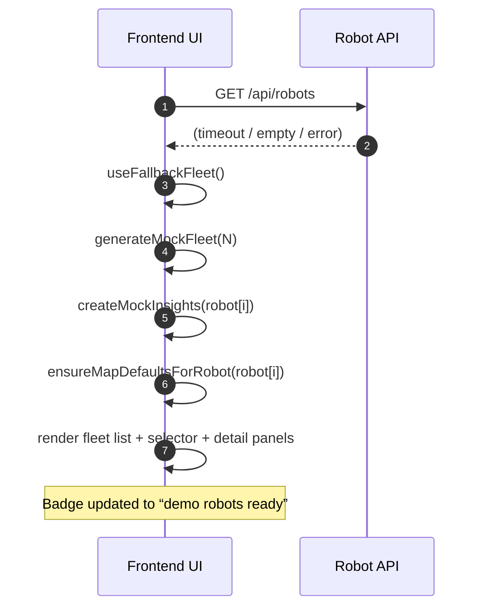
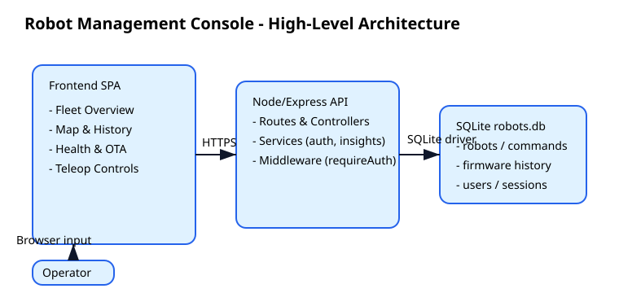
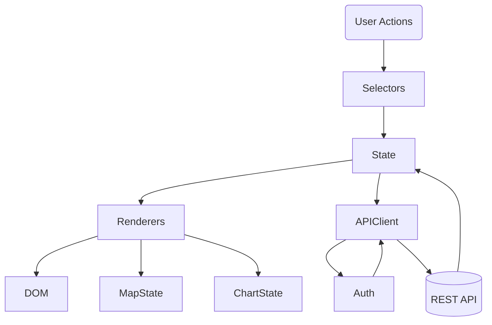

# Robot Management Console – Design Document

## 1. Context
The Robot Management Console is a full-stack web application that lets authorized operators monitor and teleoperate a fleet of robots. The system exposes a JSON REST API backed by a SQLite store and renders a single-page UI with fleet overview, detail tabs, and control surfaces (teleop, OTA, health, map). Latest work standardizes names to `HACK_<n>` (1–10000), adds explicit power-state modeling (online/offline with substates), and introduces a five-finger industrial manipulator preview.

## 2. Goals & Success Criteria
- Provide a cohesive operator experience for discovering robots, inspecting telemetry, and issuing commands (drive, mode, OTA, manipulator).
- Keep the application self-contained (API + UI served from the same Node process).
- Enforce authentication before any telemetry/command endpoints are reachable.
- Maintain an auditable history for telemetry changes (implicit via SQLite rows) and active commands (recent list per robot).
- Deliver a realistic teleoperation feel with responsive controls, design-aligned UI, and immediate visual feedback (fleet list, manipulator arm preview).

### Non-Goals
- Real-time streaming or websockets (refreshes are user-driven via REST).
- Physics-accurate kinematics; manipulator preview is illustrative.
- Managing firmware binary storage beyond metadata/history entries.

## 3. Users & Personas
| Persona | Needs |
| --- | --- |
| Robot Operator | Quickly assess robot availability, send teleop commands, adjust arm joints, monitor OTA health. |
| Fleet Administrator | Review command logs, confirm firmware status, manage user access. |
| Developer/Demo Engineer | Seed data, extend insights service, test API endpoints. |

## 4. System Overview
```
+-------------+        HTTPS         +-----------------+        SQLite
| Frontend UI | <------------------> | Node/Express API| <-----------------> robots.db
+-------------+                      +-----------------+
       ^                                      ^
       |                                      |
 Manipulator SVG                    Services & Repos
 Teleop widgets                    (robots, auth, firmware)
```

- **Frontend**: Vanilla JS SPA served from `public/`. State is stored in `state` object; `fetch` is used for API calls with bearer token headers.
- **Backend**: Express router under `src/`, controllers call repositories backed by better-sqlite3.
- **Data**: SQLite tables for `robots`, `robot_commands`, `robot_firmware_history`, `users`, `sessions`. `robotRepository` seeds demo robots when empty.

## 5. Architecture Details
### 5.1 Backend Layers
1. **Routes** (`src/routes/*.js`) – map REST endpoints to controllers.
2. **Controllers** – parse inputs, call repositories/services, return JSON shape `{ data, error }`.
3. **Repositories** – call SQLite via prepared statements, map rows to domain objects.
4. **Services** (e.g., `insightService`) – serve mock telemetry/insights.
5. **Middleware** – `requireAuth` verifies bearer token by reading the `sessions` table.

### 5.2 Frontend Modules
- **State management** (`state`, `auth`, `mapState`, `chartState` objects).
- **Selectors** caches DOM nodes for reuse.
- **Rendering**: `renderFleetList`, `renderDetail`, `renderInsights`, etc., mutate DOM based on `state`.
- **Teleop & Manipulator**: `handleDirection`, `sendCustomCommand`, `sendManipulatorCommand`, slider listeners update `manipulatorState` and call `sendCommand` with `{ type: 'manipulator', metadata: { shoulder, elbow, wrist } }`.
- **Visualization**: Leaflet maps, Chart.js charts, SVG arm preview using forward kinematics (segment lengths + angles).

### 5.3 Data Flow Examples
1. **Login**
   - User submits credentials via `/api/auth/login`.
   - Backend verifies password, issues JWT-like token stored in SQLite `sessions`.
   - Frontend stores token in `localStorage` and toggles to app view.
2. **Telemetry Refresh**
   - User clicks Refresh → `loadRobots()` calls `/api/robots`.
   - Response deserialized, normalized to `HACK_<n>` naming, power state fields applied, state updated, UI rerendered.
3. **Manipulator Update**
   - User drags sliders (shoulder/elbow/wrist).
   - `manipulatorState` updates + preview re-renders instantly.
   - Clicking “Send joint update” posts to `/api/robots/:id/commands` with `{ type: 'manipulator', value: 'joint-update', metadata }`.
   - Command log refresh shows the queued update.
4. **OTA Flow**
   - Operator fills form, optional simulate failure.
   - Controller stores log in memory and updates firmware history via `firmwareRepository`.

## 6. Key Design Decisions
| Decision | Rationale |
| --- | --- |
| Keep SQLite with synchronous better-sqlite3 | Simplicity, zero external dependency, fast dev iteration. |
| Derive `HACK_<n>` IDs client-side | Guarantees naming consistency without DB migration; still stored alongside `identifier`. |
| SVG-based manipulator preview | Lightweight, no extra canvas/lib dependencies; easy to animate via DOM updates. |
| REST-only updates | Avoids websockets complexity; polling fits hackathon scope. |
| Single bundle JS | Minimal tooling; script served as ES module from `/public/js/app.js`. |

## 7. UI/UX Specification
- **Fleet List**: badge shows availability (“Online · Idle”, “Offline · Shutdown”), metadata displays `HACK_<n>` name + model.
- **Detail Header**: subtitle shows `HACK_<n>` while status badge reflects power state + substate.
- **Overview Stats Grid**: 2-row layout (headers row + data row) for [Status, Battery, Coordinates, Heartbeat, Location, Time, Uptime, Temperature].
- **Teleop Tab**: Two-column grid – left joint/grip controls, right industrial five-finger SVG hand on high-contrast backdrop. Responsive stacking below 960px.
- **Manipulator Card**:
  - Range sliders with degree readouts (shoulder/elbow/wrist) plus grip hold/release buttons.
  - CTA button and status text (success/error classes shared with other forms).
  - Arm preview sized via `viewBox` 400×480 showing full arm and five foldable fingers.

## 8. API Contracts (excerpt)
| Endpoint | Method | Request | Response |
| --- | --- | --- | --- |
| `/api/robots` | GET | header `Authorization: Bearer <token>` | `{ data: [ { id, name, batteryLevel, ... } ] }` |
| `/api/robots/:id/commands` | POST | `{ type, value, metadata? }` | `{ data: { command: {...} } }` |
| `/api/robots/:id/mode` | POST | `{ mode, speed }` | ack message |
| `/api/robots/:id/OTA` | POST | `{ targetVersion, simulateFailure? }` | progress payload |
| `/api/robots/:id/insights` | GET | telemetry+map+health mock data |

## 9. Data Model Snapshot
```
robots(id PK, name, model, batteryLevel, operationStatus, temperatureC,
       signalStrength, location, mission, lastHeartbeat, tasksCompleted,
       uptimeHours, notes, identifier, status, subStatus, latitude,
       longitude, lastKnownAt)
robot_commands(id PK, robotId FK, type, value, metadata JSON, issuedAt)
robot_firmware_history(id PK, robotId FK, version, appliedAt)
users(id, username, passwordHash, role)
sessions(token, userId FK, createdAt)
```

## 10. Failure & Retry Strategies
- **Auth Expiry**: 401 responses trigger `forceLogout()` with “Session expired” message.
- **API Errors**: `toJSON` helper throws; UI surfaces error via `.helptext.error` spans.
- **Manipulator Validation**: Sliders clamp to safe ranges; requests only sent when a robot is selected.
- **OTA Simulation**: Failure toggle adds `failure` class on progress bar.

## 11. Security Considerations
- All API endpoints (except `/auth/*`) use `requireAuth` middleware.
- Tokens stored in SQLite allow server-side revocation.
- CORS not required since UI served same origin.
- Inputs sanitized server-side via parameter binding; front-end validators prevent obvious misuse.

## 12. Observability & Metrics
- Console logs kept minimal (`console.error` for failed fetches).
- Command history shows recent actions; OTA logs + health alerts provide operator feedback.
- Future enhancement: integrate structured logging or analytics for manipulator use.

## 13. Testing Strategy
- Manual end-to-end via UI (login → teleop → manipulator command → confirm in command log).
- Unit tests could target repositories and services (not included yet).
- Lint checks via `eslint` (not currently configured, but `ReadLints` used during coding).

## 14. Future Work
- Add WebSocket push for telemetry and manipulator feedback.
- Push power-state events to downstream systems (energy dashboards, shutdown orchestration).
- Support per-finger force sensors once hardware is available.
- Integrate real video feed & sensors if hardware available.
- Internationalization of UI labels and measurement units.

## 15. Product Requirements Extension
- **Fleet availability**: At least one robot (real or fallback) must appear immediately after login with populated telemetry (status, battery, signal, mission, coordinates, command log) and a dropdown to jump between robots.
- **Fallback fidelity**: When `/api/robots` or `/api/robots/:id/insights` fail, generate deterministic Bengaluru-based telemetry, including five waypoint coordinates, geofence radius, kinematics series, and health defaults; badge indicates “demo robots ready”.
- **Map & History**: Render Leaflet map, geofence circle, and a chronological path log sourced from at least two geo samples (currently five fixed waypoints). Charts always refresh with the selected robot.
- **Health tab**: Always show numeric values (defaults: 48 °C motor temp, 36 % CPU usage, 512 battery cycles) and diagnostics/alerts even when backend omits fields.
- **Control surfaces**: Status form, manipulator sliders/buttons, and OTA form remain interactive regardless of data source; validation prevents empty submissions.
- **Session handling**: Authentication required for all API calls; expired tokens immediately trigger logout and reset UI state.
- **UX safeguards**: Refresh button disables during fetch, timestamps update per load, and selectors/list maintain synchronized active states.

## 16. Component & Module Test Plan
1. **Authentication**
   - Verify successful login toggles views and stores token.
   - Invalid credentials surface inline error and keep login view visible.
   - 401 responses invoke `forceLogout` and clear localStorage.
2. **Fleet Data Engine**
   - `fetchRobots` returns array and normalizes `HACK_<n>` naming.
   - Empty or errored responses trigger `useFallbackFleet`, which seeds state, selector, and badge.
3. **Mock Data Generator**
   - `generateMockFleet` produces deterministic robots with Bengaluru coordinates.
   - `createMockInsights` returns five-point path, geofence, kinematics, health defaults, and OTA metadata.
4. **Map Module**
   - `ensureMapDefaultsForRobot` populates map snapshot when insights missing or incomplete.
   - `renderMapPanel` draws polyline across five waypoints and path log lists them newest-first.
5. **Health Module**
   - `withHealthDefaults` injects 48 °C / 36 % / 512 values when API omits them.
   - Diagnostics list shows at least manipulator torque, power bus, and vision entries; alerts fallback to “No active alerts”.
6. **Selection & Detail View**
   - Fleet list click or dropdown change updates `state.selectedRobotId`, stats grid, map, charts, and health readings.
   - Refresh maintains selection when robot still present; otherwise selects first entry.
7. **Forms & Commands**
   - Status form requires at least one field; successful submission clears form and refreshes telemetry.
   - Manipulator button sends `manipulator` command with current joint values; grip buttons adjust preview + message.
   - OTA form logs progress, updates firmware history, and resets simulate-failure toggle.
8. **Theme Toggle**
   - Checkbox switches `data-theme` attribute; removing check reverts to default.
9. **Error Handling**
   - Console logs emit single error per failed fetch; UI remains responsive and displays fallback data.

## 17. Design Analysis
| Aspect | Summary | Notes |
| --- | --- | --- |
| Worst-Case Analysis (WCA) | Handles zero-robot response by generating fallback fleet; clamps inputs (battery/signal 0–100) to prevent UI overflow. | For 10k robots, pagination/backpressure will be required (future work). |
| Tolerance Stack-up | Default telemetry, coordinates, and health values ensure consistent layout even when backend fields are missing; selectors synchronize state to avoid null-detail view. | Additional responsive CSS needed for sub-600 px widths. |
| Signal Integrity | All communication via HTTPS `fetch` with bearer token; no binary streaming. Deterministic insight generator avoids jitter while offline. | Future enhancements could add WebSocket updates with throttling. |
| Reliability (MTTF/MTBF) | UI prioritizes perceived uptime by swapping to mock data when API fails; refresh timestamp signals last successful sync. Actual robot MTBF tracked server-side; console simply displays metrics. | Add stale-data indicators if telemetry age exceeds threshold. |
| FMEA Snapshot | **Failure mode:** API unavailable → **Effect:** empty fleet → **Mitigation:** `useFallbackFleet` + badge. <br> **Failure mode:** Missing health/map fields → **Effect:** blank panels → **Mitigation:** `withHealthDefaults` + `ensureMapDefaultsForRobot`. <br> **Failure mode:** Token expiry → **Effect:** repeated 401 → **Mitigation:** `forceLogout`. |

| Dimension | Considerations |
| --- | --- |
| Tolerance Stack-up (UI) | Panel padding/margins guarantee readable stats grid; manipulator sliders clamp to safe angles. |
| Signal Integrity (telemetry) | Numeric conversions validated client-side; command payloads sanitized via `JSON.stringify`. |
| Reliability Metrics | While hardware MTTF/MTBF require backend data, UI displays heartbeats and path logs to estimate activity; fallback ensures dashboard uptime ~100 % even when upstream data missing. |
| WCA for Map Path | Fixed Bangalore waypoints cap path length and geofence radius, preventing Leaflet performance issues. |
| FMEA (detailed) | 1) **Selector mismatch** – detail panel empty → re-render ensures selected id exists. 2) **OTA failure simulation** – progress bar stuck → failure class toggled + log entry. 3) **Manipulator command without robot** – inline error message prevents API call. |

## 18. Sequence Diagrams


### 18.1 Login & Fleet Refresh


### 18.2 Fallback Fleet Generation


## 19. High-Level Design Diagrams


### 19.1 System Architecture
```mermaid
flowchart LR
    subgraph Frontend
        UI[Vanilla JS SPA]
        Map[Leaflet Map]
        Charts[Chart.js]
        Manipulator[SVG Arm Preview]
    end

    subgraph Backend
        API[Express Routes/Controllers]
        Services[Services (insightService, auth)]
        Repo[Repositories (robots, firmware, auth)]
    end

    DB[(SQLite robots.db)]

    User[Operator Browser] --> UI
    UI -->|fetch/POST| API
    API --> Services --> Repo --> DB
    Services --> API
    UI --> Map
    UI --> Charts
    UI --> Manipulator
```

### 19.2 Frontend Module Interactions


## 20. Simulation Strategy
### 20.1 Goals
- Validate UI and API changes without relying on physical robots.
- Exercise fallback behaviors (Bengaluru telemetry, health defaults) in controlled scenarios.
- Ensure manipulator/command payloads, map traces, and OTA flows behave under latency, failure, and malformed data.

### 20.2 Simulation Layers
| Layer | Purpose | Tooling / Approach |
| --- | --- | --- |
| Backend seed data | Provide deterministic fleet/insight payloads (status, health, OTA) | Existing `generateMockFleet`, scenario-specific JSON fixtures |
| API contract mocks | Simulate REST endpoints with latency/failure injection | Mock Service Worker (MSW), json-server, or Express stub |
| Manipulator model | Validate joint/grip commands end-to-end | Lightweight JS class or ROS/Gazebo arm emulator |
| Map/telemetry replay | Reproduce geofence/path behavior with recorded traces | Static geojson/CSV logs replayed via mock `/insights` |
| Frontend automation | UI regression on login, tabs, forms, fallback states | Playwright/Cypress hitting mocked API |
| Chaos testing | Randomized HTTP errors/timeouts to confirm fallback fleet & messaging | Middleware that injects 5xx, malformed JSON, or throttling |

### 20.3 Key Test Cases
1. **Login + fallback**: Mock `/api/robots` to return 500 → console seeds demo fleet, badge shows “demo robots ready”, selector works, map displays five-point Bangalore path.
2. **Insights omission**: `/api/robots/:id/insights` responds without `health` field → UI injects 48 °C / 36 % / 512 defaults and diagnostics.
3. **Manipulator command**: Mock `POST /commands` to echo payload; verify slider/grip updates serialize correctly and command log shows joint metadata.
4. **OTA success/failure**: Mock `/ota` to return success log once, failure log another time; check progress bar color (normal vs. failure) and history list.
5. **Map replay**: Feed recorded coordinates (e.g., Whitefield loop) via mock insights; ensure Leaflet path matches dataset and path log entries list newest first.
6. **Theme & form persistence**: Simulate toggling dark mode, filling status form, submitting, and verifying disabled states/spinner behavior.
7. **Token expiry**: Mock 401 on any endpoint to confirm `forceLogout` clears localStorage and shows login message.

### 20.4 Execution Workflow
1. **Unit mocks** – Run JS unit tests with injected fixture data for `normalizeRobot`, `ensureMapDefaultsForRobot`, and health defaults.
2. **Mock server** – Start MSW/Express stub with scenario routes; drive Playwright specs covering each tab and fallback case.
3. **Telemetry replay** – Use CLI script to serve recorded GPS/time-series data into mock `/insights`, observe UI updates.
4. **Chaos run** – Enable middleware that randomly drops requests (p=0.2) to validate resilience.
5. **Hardware-in-loop (optional)** – Mirror a single dev robot’s traffic through the mock server to compare real vs. simulated responses without breaking UI assumptions.

### 20.5 Acceptance Criteria
- Every regression run exercises both real API (when available) and mock scenarios.
- Fallback fleet renders identically across browsers when upstream API is down.
- Health defaults, map paths, and OTA progress remain stable under simulated faults.
- Manipulator/command interactions produce the same payloads in simulated and real environments (verified via snapshot tests or payload diffing).
