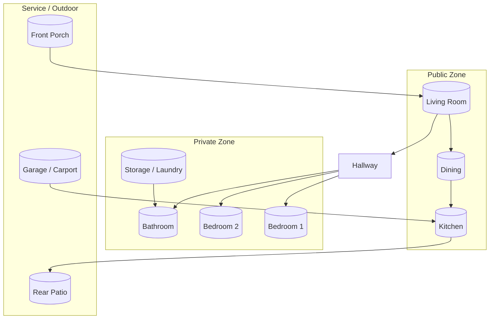

# Simple Home Layout

The diagram below sketches a compact single-story home suited for conceptual discussions. Edit node names or connections to reflect your actual layout.

## Notes

- Public rooms align on the south facade (porch → living → dining) for natural light.
- Bedrooms cluster off a short hallway to minimize circulation space.
- Service spaces (garage, patio) connect near the kitchen for easy egress and deliveries.
- Adjust the grouping or add nodes for offices, flex rooms, or multi-story stairs as needed.
