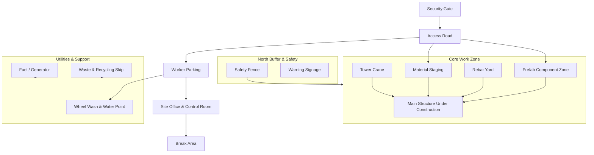

# Construction Site Diagram

The diagram below captures a compact construction site arrangement highlighting circulation, safety, and operational zones. Modify node labels or positions as needed to match the specifics of your project.

## Key Notes

- `Core Work Zone` is centered to minimize crane swing over public areas.
- `Services` block remains downwind to keep fumes/noise away from the office.
- Security gate and wheel wash align with the access road to control vehicle flow.
